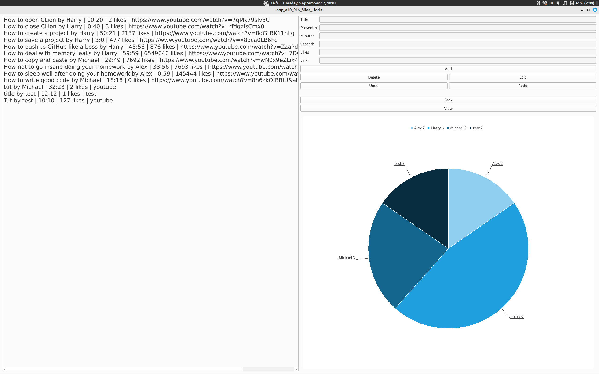
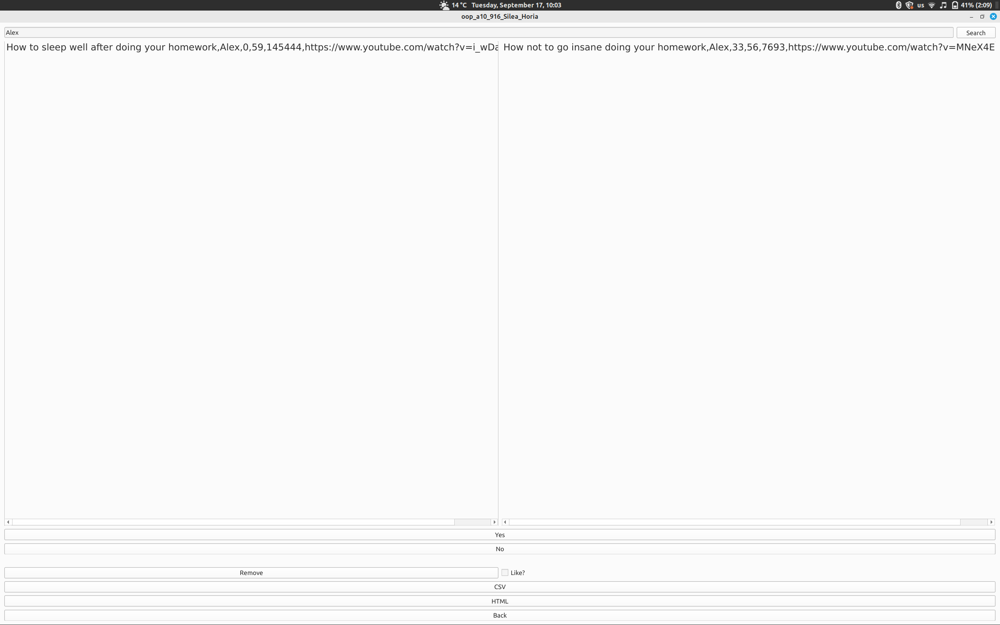

# Tutorial-Watch-List
 An application that holds a list of tutorials, editable by an admin user, who can also see the statistics of said list.
 
 A normal user can search for tutorials, add them to a watch list, remove them and choose whether to like them or not. The app supports opening links in the browser and saving the wathc list locally in a csv or html format.

